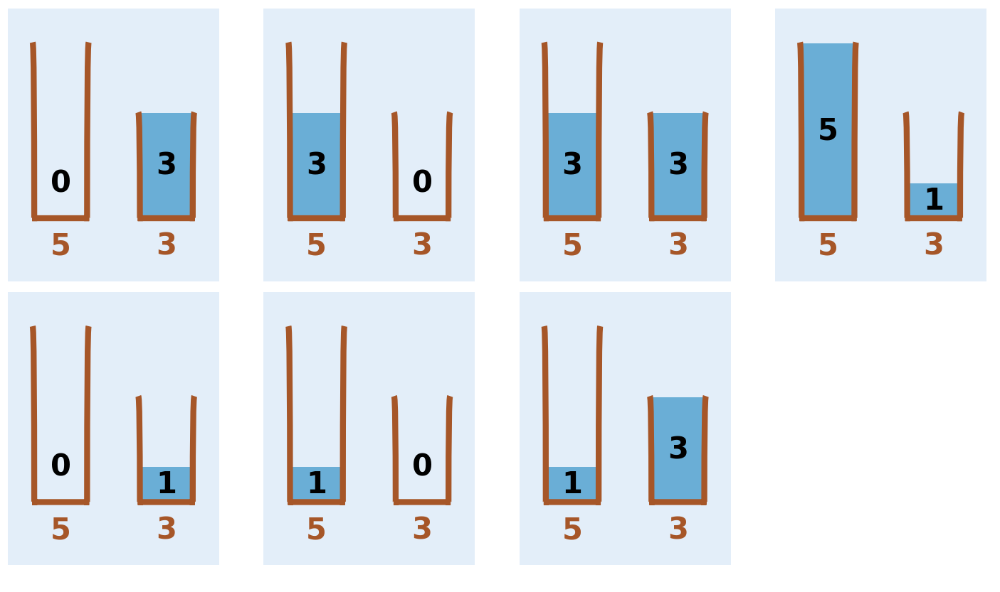

# Bonbon
Almir i Berin imaju vreću za bombone koje mogu primiti `a` (Almirova vreća) i `b` (Berinova vreća) bombona. Također im je na raspolaganju mašina koja može da izbaci neograničenu količinu bombona.

Njih dvojica su zamislili broj `c`. Njihova ideja je da pokušaju da u vrećama `a` i `b` zajedno imaju tačno `c` bombona. Uz to je moguće uraditi samo sljedeće operacije:
- Napuniti vreću `a` ili `b` do vrha iz mašine.
- Isprazniti vreću `a` ili `b`.
- Presuti bombone, koliko god je moguće, iz vreće `a` u vreću `b` ili obrnuto, bez presipanja.

Pomozite Almiru i Berinu tako što ćete napisati program koji isipsuje minimalan broj koraka da se dođe do željenog rezultata!

*Napomena: na početku su kese obojici uvijek prazne*

## Ulaz
Na ulazu su vam data tri broja, svaki u zasebnoj liniji: `a`, `b` i `c`

### Ograničenja
```
0 <= a, b, c <= 20 000 000
```
- Podzadatak 1 (2 boda): rješenje je `0` ili `1`.
- Podzadatak 2 (4 boda): rješenje je `2`.
- Podzadatak 3 (4 boda): rješenje je `-1`.
- Podzadatak 4 (50 bodova): rješenje je `<80000`.
- Podzadatak 5 (40 bodova): bez dodatnih ograničenja.

## Izlaz
Na jednoj i jedinoj liniji izlaza potrebno je ispisati broj koraka do traženog cilja - opisano u postavci zadatka.

## Primjeri
### Ulaz 1
```
5
3
4
```
### Izlaz 1
```
7
```
### Objašnjenje 1
Punjenjem i pražnjenjem kesica dobijamo različite zbirove. Nakon svih operacija u prvoj vrećici bude jedna bombona a u drugoj 3, `1 + 3 = 4`.

