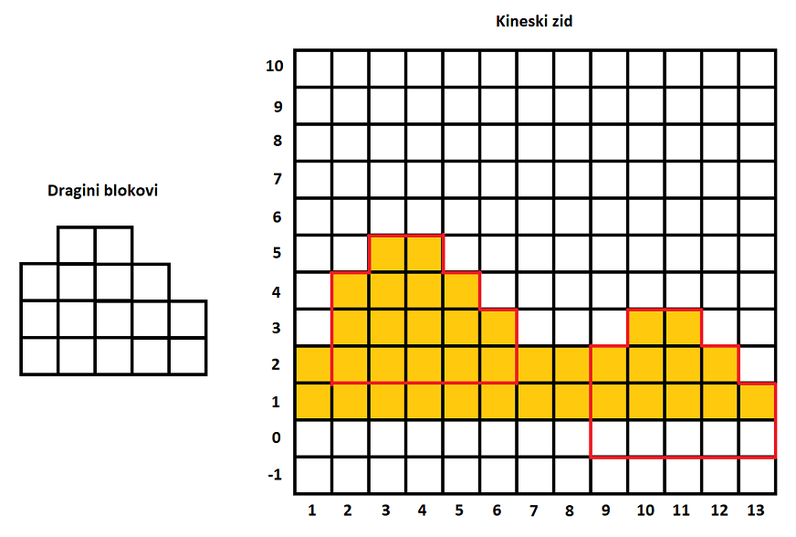

# Zid
Postoje razne teorije kako je građen Kineski zid. Kako god bilo, jedno je sigurno, sastoji se od blokova kamena. Gledano sa jedne strane, mogli bi da ga podijelimo na više pravougaonih blokova različite visine. 

Drago je očaran samom idejom Kineskog zida i stoga je odlučio da napravi u svome dvorištu manju repliku tog zida. Nakon što je završio, odlučio je da uporedi te zidove i ustanovi koliko je njegov rad kvalitetan.

On je posmatrao uzastopne blokove Kineskog zida dužine `N` i uzastopne blokove svoga zida dužine `M`. Zatim se zapitao, na koliko mjesta on može da vidi sličnost svoga zida posmatrajući samo vrhove tih zidova?

Drugom rječju, njegov segment zida dužine `M` liči na neki segment Kineskog zida te dužine ako su visine svih blokova jednake u oba zida duž cijelog segmenta, ili ako se svi blokovi razlikuju za neku konstantnu vrijednost (jer se posmatraju samo vrhovi). Radi lakšeg shvatanja, možete zamisliti da se svi segmenti Kineskog zida mogu povećati ili smanjiti za neku konstantnu vrijednost i onda se porediti (čak ako idu i ispod zemlje) **(Pogledati sliku)**.

Dragu zanima koliko segmenata Kineskog zida liči na njegov zid ako ih poredi na ovakav način.

## Ulaz
Prva linija na ulazu sadrži dva pozitivna cijela broja `N` i `M`.

`N` označava dužinu Kineskog zida koja se posmatra, a `M` označava dužinu Draginog zida koja se posmatra.

Druga linija sadrži `N` pozitivnih cijelih brojeva `A[i]` koji označavaju redom visine blokova Kineskog zida. Ovi brojevi su podijeljeni praznim prostorom.

Treća linija sadrži `M` pozitivnih cijelih brojeva `B[i]` koji označavaju redom visine blokova Draginog zida. Ovi brojevi su podijeljeni praznim prostorom.

### Ograničenja
```
1 <= M <= N <= 200 000
1 <= A[i] <= 1 000 000 000
1 <= B[i] <= 1 000 000 000
```
### Podzadaci
* Podzadatak 1 (10 bodova): `1 <= N, M <= 15`
* Podzadatak 2 (10 bodova): `M = 1`
* Podzadatak 3 (40 bodova): `N <= 200`
* Podzadatak 4 (40 bodova): bez dodatnih ograničenja


## Output
Output sadrži samo jednu liniju - pozitivan cijeli broj koji označava koliko dijelova Kineskog zida liči na Dragin zid.

## Primjeri
### Ulaz 1
```
13 5
2 4 5 5 4 3 2 2 2 3 3 2 1
3 4 4 3 2
```
### Izlaz 1
```
2
```
### Objašnjenje 1
Segmenti Kineskog zida su označeni žutom bojom. Segmenti koji su slični su uokvireni crvenom bojom na slici. Dragin segmenat i segmenat na indeksu 9 očigledno nisu iste visine, ali ako im posmatramo samo vrhove, oni su jednaki.

