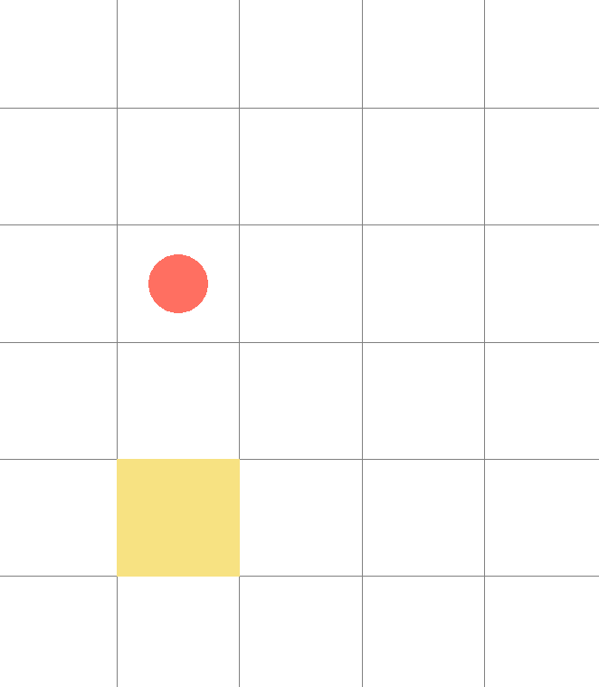
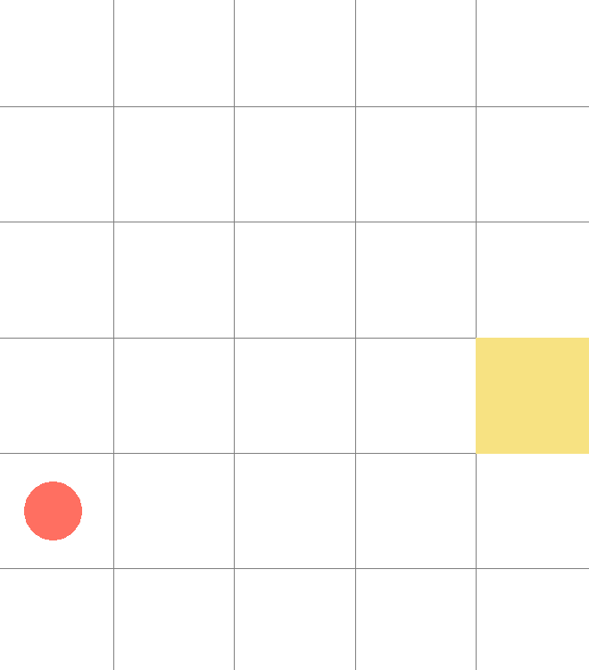
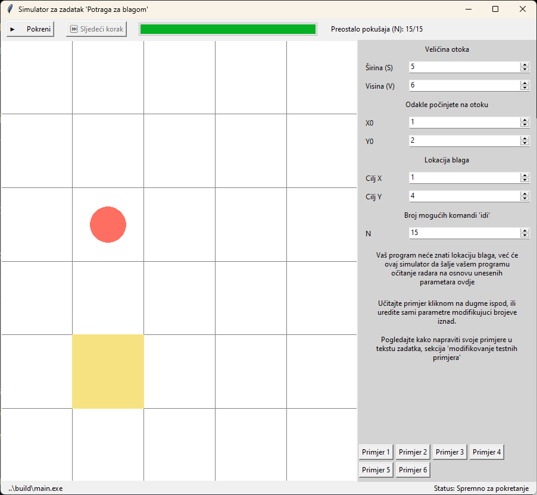
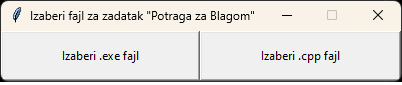
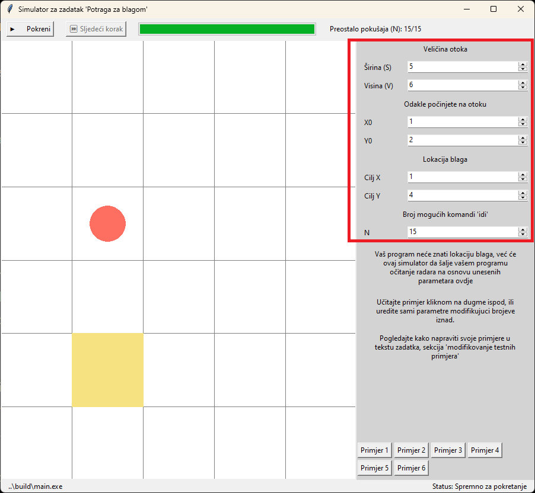
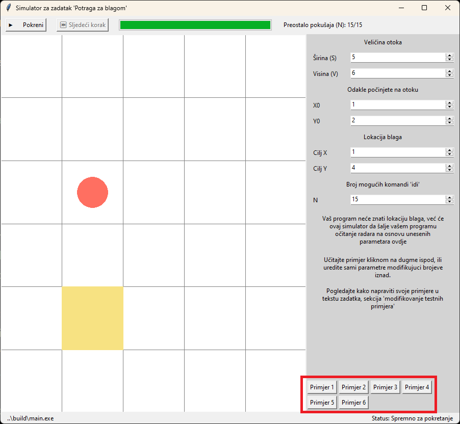
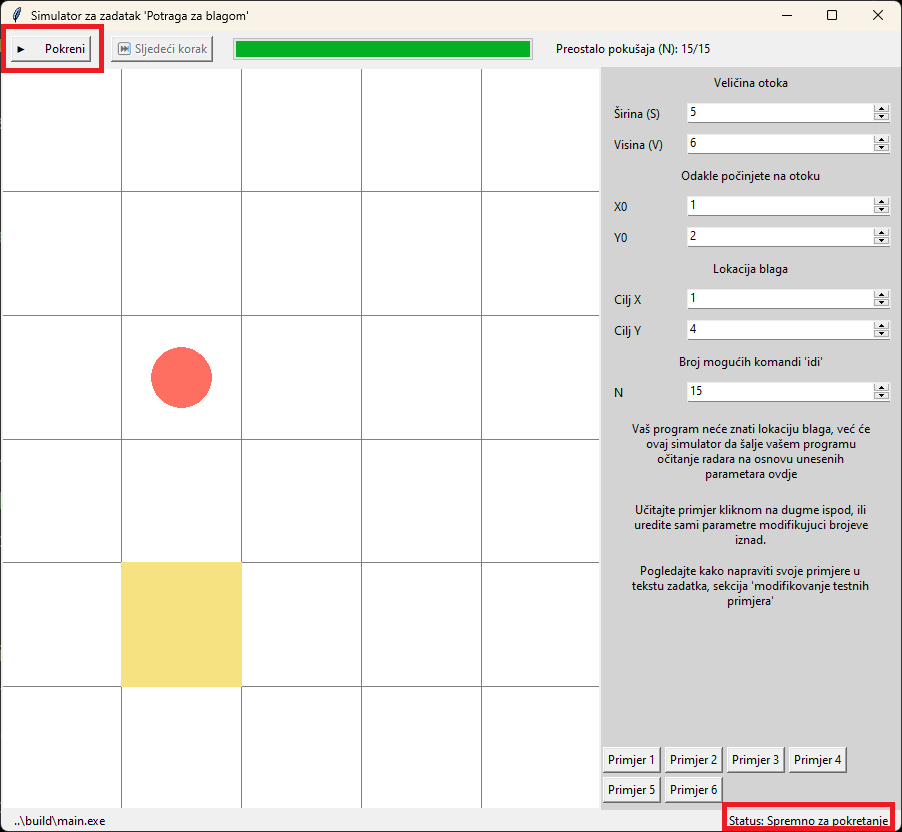

# Potraga za blagom

Moler Ramiz vam je rekao da na jednom otoku ima kovčeg sa zlatom. Možete u to biti 100% sigurni jer se zakleo majkom. Prodao vam je uz to i radar za 5 maraka kojim ćete ga navodno moći i pronaći. Iz razonode ste ipak odlučili posjetiti otok i probati se obogatiti. I, gle čuda, radar zaista radi i na otoku zaista postoji blago! No, nažalost, pošto ga je nabavio s auto-pijace, izgleda da ipak nije baš od najbolje kvalitete. Radar je skoro pa pokvaren i znate da se može koristiti samo `N` puta prije nego se skroz pokvari. Vaš je zadatak da date odgovor na pitanje "gdje se nalazi blago" prije nego radar postane neupotrebljiv.

Odlučili ste se da ćete probati doći do odgovora na sljedeći način:
1. Početi pretragu sa lokacije X<sub>0</sub>, Y<sub>0</sub>
1. Iskoristiti radar da dobijete očitatnje sa trenutne lokacije
1. Otići na lokaciju X<sub>i</sub>, Y<sub>i</sub>
1. Ponoviti od koraka 2 dok ne budete sigurni da ste pronašli zlato, te date odgovor za lokaciju

## Ostrvo
Ostrvo je pravougaonog oblika širine `S` i visine `V`. Vi se možete kretati bilo gdje na prostoru ostrva.

Koordinate ostva su predstavljene sa `(0, 0)` do `(S-1, V-1)`.

Tačke koje imaju manju X koordinatu su zapadno a one koje imaju veću X koordinatu su istočno. Shodno tome, one koje imaju manju Y koordinatu su sjeverno a one koje imaju veću Y koordinatu su južno. Koordinata `(0, 0)` se nalazi gore-lijevo (sjevero-zapadno) a koordinata `(S-1, V-1)` se nalazi dole-desno (jugo-istočno).

Na primjer, ako je `S = 2` a `V = 3` validne koordinate na ostrvu su `(0, 0)`, `(1, 0)`, `(0, 1)`, `(1, 1)`, `(0, 2)` i `(1, 2)`, pri tom `(0, 0)` je najgornja (najsjevernija) tačka, zajedno sa `(1, 0)`.

## Radar

Radar će vam pružiti smjer blaga D<sub>i</sub> na osnovu vaše trenutne pozicije:
- `S` - Sjever (Gore)
- `SI` - Sjevero-istok (Gore-Desno)
- `I` - Istok (Desno)
- `JI` - Jugo-istok (Dole-Desno)
- `J` - Jug (Jug)
- `JZ` - Jugo-Zapad (Dole-Lijevo)
- `Z` - Zapad (Lijevo)
- `SZ` - Sjevero-Zapad (Gore-Lijevo)
- `*` - Tačno ste na lokaciji blaga

Karakter `S` u smjeru će se uvijek pokazati ukoliko je blago iznad vas po Y osi. Slično važi i za `I`, `Z`, `J`.

Na slici ispod, vi ste crveni krug a žuti kvadrat je blago. U ovom slučaju će radar pokazati `J`.



U ovom slučaju će radar pokazati `SI` jer se blago nalazi i iznad vas i desno od vas.




## Ulaz/Izlaz
U ovom zadatku ćete komunicirati sa sistemom za ocjenjivanje (grader-om) interaktivno da bi ste došli do cilja. Način na koji ćete komunicirati sa grader-om je putem standardnog ulaza i izlaza. Da bi vam olakšali programiranje, možete koristiti vizuelni grader simulator koji možete preuzeti sa sistema za pregledavanje (više o tome kasnije).

Komunikacija se uvijek odvija u krug na sljedeći način:
1. Grader na standardni ulaz vašeg programa pošalje podatke (dakle dostupni su vam na `cin`/`scanf`)
2. Vaš program pošalje podatke graderu kroz standardni izlaz vašeg programa (dakle kroz `cout`/`printf`)
3. Ponovo grader pošalje podatke
4. Ponovo vaš program pošalje podatke
5. ...

Pri tom obavezno uvijek pazite na sljedeće stvari:
- Kada ispisujete jednu "rundu" vašeg izlaza **morate** ga završiti sa pritajnem nove linije (`endl`/`"\n"`)
- Dovoljno je da ispišete znak za novu liniju jedanput po komandi ispisa.
- Grader će također slati podatke prema vašem programu liniju-po-liniju
- **Uvijek** pročitajte od gradera **SVE** podatke koje vam daje, pa čak iako vam ne trebaju.
  - Na primjer, ukoliko vaš algoritam ne gleda broj mogućih korištenja radara (`N`) opet ga morate pročitati kako bi vaš ulaz bio sihnorizovan sa izlazom gradera.

Na prvoj liniji će vam se uvijek nalaziti inicijalizacijski ulaz. Potom ćete vi dati vaš odgovor, a potom učitate podatke sa grader-a, potom vi ispišete podatke graderu, itd.

### Inicijalizacijski ulaz
U prvom redu standardnog ulaza će vam grader poslati 6 brojeva `S V X0 Y0 D0 N`:
- `S` je širina ostrva
- `V` je visina ostrva
- `X0` je X koordinata početne tačke od koje polazite
- `Y0` je Y koordinata početne tačke od koje polazite
- `D0` je smjer prema blagu koji je očitan sa lokacije `(X0, Y0)`
- `N` je koliko je preostalo mogućih upotreba radara

*Broj `N` označava koliko je ostalo mogućih očitanja **NAKON** vašeg inicijalnog očitanja s pozicije `(X0, Y0)`, odnosno, na broj `N` **NE UTIČE** činjenica da ste upravo očitali smjer `D0` sa lokacije `(X0, Y0)`.*

### Izlaz
Za izlaz imate 2 izbora:
1. `idi Xi Yi` - Odite na koordinate `(Xi, Yi)` i grader će vam za vaš sljedeći unos pripremiti smjer
2. `odgovor X Y` - Kažite graderu vaš odgovor za lokaciju blaga.
*Napomena: sadržaj svake komande se mora ispisati u jednoj liniji (ne razdvajati u nove redove Xi i Yi).*

*Napomena: Na kraju svake komande morate ispisati novi red (`\n` ili `endl`).*

#### Napomene za komandu `idi`
- Komandu `idi` je moguće iskoristiti najviše `N` puta
- Ukoliko komandu `idi` iskoristite više od `N` puta vaš program će biti prekinut i nećete dobiti bodove za taj test
- Ukoliko koordinate `(Xi, Yi)` nisu validne, vaš program se zaustavlja i nećete dobiti bodove za taj test

#### Napomene za komandu `odgovor`
- Nakon što ovu komandu ispišete trebate završiti vaš program (naprimjer sa `return 0` u main funkciji) i grader će provjeriti da li je vaš odgovor tačan.
- Očekuje se da komandu `odgovor` ispišete **tačno** jedanput
- Komandu `odgovor` morate **UVIJEK** ispisati, pa čak iako vam radar govori da se nalazite tačno na lokaciji blaga (`*`)
- Ukoliko **ne** pošaljete komandu `odgovor` u manje od `N` komandi `idi`, nećete dobiti bodove za taj test
- Dozvoljeno je komandu `odgovor` poslati čak i nakon `N` komandi `idi`

### Ulaz (nastavak)
Ulaz koji trebate učitati nakon inicijalizacijskog ulaza i nakon što ispišete vaš prvi izlaz je jedna linija koja sadrži string `Di`. Taj string predstavlja smjer blaga koji radar pokazuje (opisano u sekciji "Radar" iznad). Ovaj ulaz će vam grader slati sve dok šaljete komandu `idi`, odnosno dok ne pošaljete komandu `odgovor`. Maksimalan broj unosa je `N`.

## Ograničenja
```
1 <= S, V <= 100
0 <= N <= 10000
0 <= Xi, X0 < S
0 <= Yi, Y0 < V
```
### Podzadak 1 (3 boda)
- `S = 1`
- `N = 10000`

### Podzadak 2 (10 bodova)
- `S = 1`

### Podzadak 3 (15 bodova)
- `S = 1`
- `N` će biti manje nego u prethodnom podzadatku

### Podzadak 4 (3 boda)
- `V = 1`
- `N = 10000`

### Podzadak 5 (10 bodova)
- `V = 1`

### Podzadak 6 (15 bodova)
- `V = 1`
- `N` će biti manje nego u prethodnom podzadatku

### Podzadak 7 (3 boda)
- `N = S * V`

### Podzadak 8 (3 boda)
- `N = S + V`

### Podzadak 9 (17 bodova)
- Bez ograničenja, ali sa većim `N` nego u sljedećem podzadatku

### Podzadak 10 (21 bodova)
- `N` će biti manje nego u prethodnom podzadatku

## Primjeri
### Primjer 1
| Grader -> Program | Program -> Grader | Komentar                                                                                                                |
|-------------------|-------------------|-------------------------------------------------------------------------------------------------------------------------|
| `5 6 1 2 J 7`     |                   | Ostrvo je dimenzija `5x6`. Mi krećemo sa pozicije `(1, 2)`. `J`užno od nas je blago. Imamo `7` pokušaja da ga pronađemo |
|                   | `idi 2 5`         | Idemo na polje `(2, 6)`. U ovom trenutku ostalo nam je još `6` pokušaja da pronađemo blago, odnosno `N = 6`             |
| `SZ`              |                   | Grader nam govori da se blago nalazi `S`jevero-`Z`apadno od nas (gore-lijevo).                                          |
|                   | `idi 1 4`         | Idemo na polje `(1, 4)`. U ovom trenutku `N = 5`                                                                        |
| `*`               |                   | Grader nam govori da se nalazimo tačno na lokaciji blaga!                                                               |
|                   | `odgovor 1 4`     | Govorimo graderu da mislimo da smo pronašli blago na polju `(1, 4)`                                                     |

### Primjer 2
*Napomena: Ovakav primjer inicijalizacijskog ulaza neće doći od gradera jer ne postoji optimalno rješenje za ovaj slučaj. Ovo je primjer u kojem pokazujemo kako treba pratiti koliko nam je ostalo pokušaja.*

| Grader -> Program | Program -> Grader | Komentar                                                                                                                           |
|-------------------|-------------------|------------------------------------------------------------------------------------------------------------------------------------|
| `6 6 5 5 SZ 1`    |                   | Ostrvo je dimenzija `6x6`. Mi krećemo sa pozicije `(5, 5)`. `S`jevero-`Z`apadno je blago. Imamo `1` pokušaj                        |
|                   | `idi 0 0`         | Idemo na polje `(0, 0)`. U ovom trenutku nemamo više pokušaja za testirati. Naša sljedeća komanda graderu bi morala biti `odgovor` |
| `J`               |                   | Grader nam govori da se blago nalazi `J`užno od nas (dole).                                                                        |
|                   | `idi 0 1`         | Idemo na polje `(0, 1)`. U ovom trenutku će grader ugasiti ovaj program i dati 0 bodova za ovaj primjer jer smo pokušali izvršiti komandu `idi` a nemamo više pravo na tu komandu. Ovaj program je trebao koristiti komandu `odgovor` da da konačni odgovor. |

# Simulator
Savjetujemo da koristite naš simulator pomoću kojeg možete olakšano debugirati program. Skinite "simulator.zip" koji je dostupan na web stranici takmičenja. U simulatoru vaš "igrač" se označava kao crveni krug a blago kao žuti pravougaonik.



## Kroštenje simulatora
### Paljenje
1. Raspakujte sadržaj zip fajla koji ste preuzeli sa stranice takimčejna
2. Pokrenite "simulator.exe" fajl
3. U prvom koraku će program da vas pita da li želite odabrati .exe ili .cpp fajl.
4. Pali se glavni prozor simulatora. Više ne morate prolaziti kroz korake iznad (biranje .cpp ili .exe fajlova) jer će vaša opcija ostati upamćena u toku korištenja simulatora



- Ukoliko je podržano na vašem sistemu, savjetujemo vam da koristite .cpp opciju i simulator će da pri svakom pokretanju vašeg programa kompajlirati vaš program u .exe i pokrenuti ga.
- Ukoliko odaberete .exe opciju, **moraćete vi kompajlirati program** prije nego što kliknete dugme "pokreni" na glavnom prozoru.

### Konfiguracija
Na desnoj strani vam se nalazi odjeljak u kojem možete modifikovati parametre po kojem će se simulacija odvijati.



Kliknom na testne primjere u dnu ćete učitati automatski šablon za parametre otoka.



Moguće je i modifikovati primjere koje imate na dugmadima "Primjer x". Pogledajte ispod u sekciji "Modifikovanje testnih primjera".

### Stanje simulacija
Simulator može biti u dva stanja: Pokrenuto i spremno. Ako je pokrenuto znači da je vaš program uspješno pokrenut i čeka na naredne korake od simulatora (tačnije, čeka na dugme "Sljedeći korak").

### Pokretanje
Kliknite na dugme "Pokreni" i vaš .exe program će se pokrenuti (ukoliko je to moguće, na primjer, u koliko nije došlo do greške u kompajliranju)



Program ostaje upaljen sve dok ne kliknete "Zaustavi" dugme, ili dok se ne završi simulacija klikanjem na "Sljedeći korak".

### Dugme "Sljedeći korak"
Vaš program neće dobiti unos dok ne kliknete "Sljedeći korak" dugme. Klikom ovog dugmeta ćete poslati jednu liniju u vaš program. Nakon što se pošalje tekst, vaš program ima 1s da odgovori na upit od simulatora. Nemojte zaboraviti dotati `\n` na kraju vašeg ispisa, inače simulator/judge neće prihvatiti vaš izlaz.

## Debugiranje
Ukoliko koristite simulator za pokretanje programa, savjetujemo da koristite `cerr` umjesto `cout` (odnosno `fprintf(stderr, ...)` umjesto `printf(...)`) za neke dodatne ispise, a koji ne želite da vam gleda judge ili simulator. Na primjer, nakon svakog poteza možete ispisati varijablu `N` na slijedeći način: `cerr << N << endl` odnosno `fprintf(stderr, "%d\n", N)`, te će se na terminalu od simulatora vaš ispis pojaviti, a pri tom će vaš ispis biti prihvaćen i od simulatora i od judge-a (kada predate zadatak na takmičenje za ocjenjivanje).

## Modifikovanje testnih primjera
Možete otvoriti fajl "primjeri.txt" u notepadu (ili drugom programu) kako biste promijenili primjere koje dobijete uz program, te kako bi vaši testni primjeri bili na dohvat ruke! Svaka linija koja nije prazna predstavlja jedan testni primjer. Možete dodati, obrisati ili modifikovati postojeće primjere kako želite. Svaki uspješno učitani primjer će biti prikazan kao dugme u dunjem desnom dijelu ekrana.

Format svake linije je: `S V X0 Y0 XS YS N` a pri tom `XS` i `YS` su rješenje za ovaj primjer, a ostale varijable su objašnjenje u tekstu zadatka iznad.

Nakon modifikovanja fajla "primjeri.txt" **morate restartovati simulator**. Pri paljenju simulatora **pratite poruke u terminalu da biste vidjeli da li su svi primjeru uspješno učitani**.

