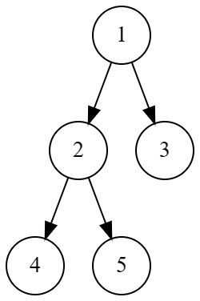
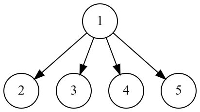
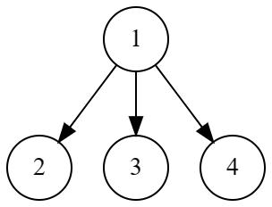

# Drvosječa
Drvosječa Drago je u duši estetičar. Dok je obilazio svoju šumu, zastao je pored jednog stabla. Nezadovoljan njegovom visinom, odlučio je da napravi neke izmjene.

Stablo se sastoji od `N` čvorova. Čvorovi su numerisani brojevima od *1* do `N` redom. Korijen stabla je čvor broj *1*.

Drago može sljedeću operaciju ponoviti najviše K puta:
* Izabrati granu `(v, u)` takvu da je čvor `v` roditelj čvora `u`
* Ukloniti granu `(v, u)`
* Nakalemiti granu `(1, u)` (dodati `u` i čitavo njegovo podstablo kao dijete korijena)

Stablo je visoko onoliko koliko iznosi dubina najdubeg čvora u stablu. Dubina čvora je broj grana na putu od korijena do tog čvora. Dubina korijena je uvijek *0*. 

Dragu zanima koja je najmanja visina stabla koja se može dobiti ako ga uredi na optimalan način.

## Ulaz
Prva linija na ulazu sadrži 2 cijela broja `n` i `k` - broj čvorova u stablu i maksimalan broj operacija koje se mogu izvršiti. 
Druga linija sadrži `n – 1` cijelih brojeva `p[2], p[3], ... p[n]` - roditelj čvora `i`.

### Ograničenja
```
1 <= n <= 200000
0 <= k <= n - 1
1 <= p[i] < i
```
### Podzadaci
* Podzadatak 1 (30 bodova): `1 <= n <= 100`
* Podzadatak 2 (20 bodova): `k <= 1`
* Podzadatak 3 (50 bodova): Bez dodatnih ograničenja

## Izlaz
Izlaz sadrži pozitivan cijeli broj koji označava najmanju visinu stabla koja se može dobiti ako se operacija ponovi najviše `k` puta.

## Primjeri
### Ulaz 1
```
5 1
1 1 2 2
```
### Izlaz 1
```
2
```
### Objašnjenje 1
Drvo na ulazu izgleda ovako:


S obzirom da imamo pravo samo na jednu operaciju, to nam nije dovoljno da učinimo ovo drvo kraćim, te je rješenje 2 (to je i dubina stabla u početnom stanju).
### Ulaz 2
```
5 2
1 1 2 2
```
### Izlaz 2
```
1
```
### Objašnjenje 2
Drvo na ulazu izgleda isto kao u prvom primjeru ali ovoga puta imamo pravo na dvije operacije. Možemo prebaciti grane 4 i 5 da budu spojene sa korijenom te ćemo tako dobiti drvo dubine 1 (kao u slici ispod).


### Ulaz 3
```
4 3
1 1 1
```
### Izlaz 3
```
1
```
### Objašnjenje 3
Drvo na ulazu već ima dubinu 1 te nije moguće ga učiniti kraćim od ovoga. Drvo na ulazu izgleda kao na slici ispod.
