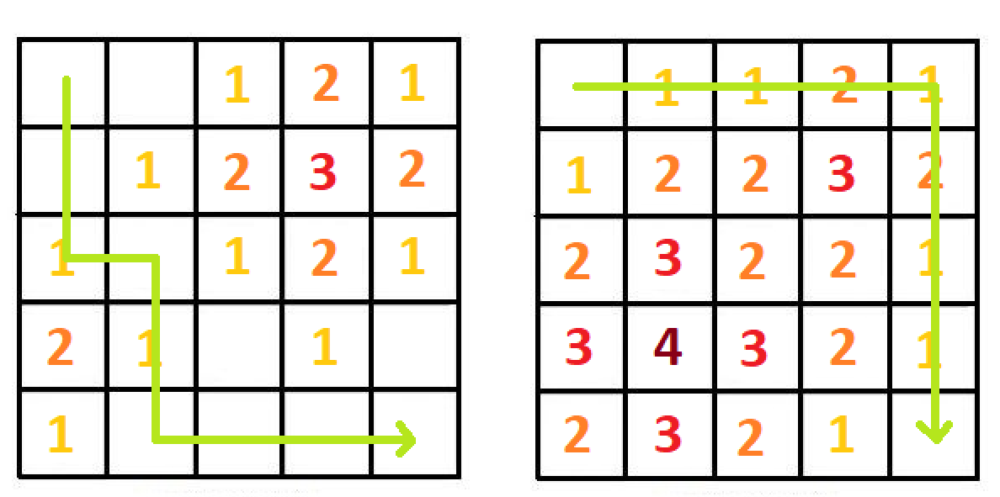
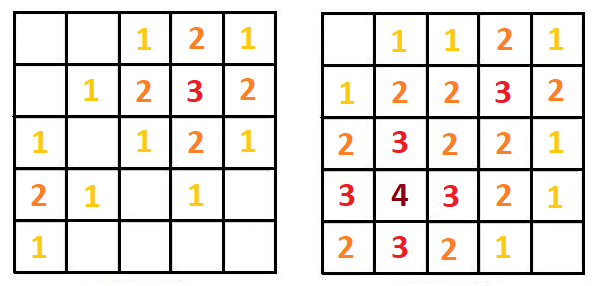

# Pustolovina

Jednog, na prvi pogled, sasvim običnog sunčanog dana, mali Drago je uživao u ljetnom raspustu pecavši ribu u svojoj rijeci. Kako se dan privodio kraju, Drago se spremao da krene nazad kući, kada su mu neobični zraci svjetlosti koji su dolazili iz rijeke privukli pažnju. Radoznale persone, kakvu je Drago imao, odmah je uskočio u rijeku i izvadio zlatan prsten na kome su bila urezana misteriozna slova u nepoznatom jeziku.

Drago je otišao do svoga sela i raspitivao se o prstenu danima, sve dok jednom nije naišao na jednog starca koji mu je rekao da je to prsten velikog zla, i da mora da ga uništi ali da će to moći da uradi samo tako što će ga baciti u aktivni vulkan na planini Maglić. Drago je uzeo ovu veliku odgovornost na sebe, i krenuo na pustolovinu da uništi prsten.

Na prvu prepreku na koju je naišao je navigacija kroz brdoviti teren, na kome se nalaze brojene planine različitih visina. Teren možemo predstaviti kao `N`x`M` matricu, a planine ćemo označiti na matrici sa njihovim koordinatima i visinom (`x`,`y`,`h`). Planine okupiraju i susjedne ćelije, ali sa visinom koja se postepeno smanjuje (susjedne ćelije su one koje dijele jednu ivicu). Dvije planine se mogu i preklapati, pri čemu tada dominira ona koja je viša. Recimo da imamo teren *5x5* i u prvom slučaju planine: *(4,1,2)* i *(2,4,3)*, a u drugom: *(4,2,4)* i *(2,4,3)*. Izgledi oba terena su dati na slici (ne označena polja predstavljaju ravnice - visina *0*).



Poznato je da mali Drago ne voli brdovite predjele, te da će uvijek izabrati put sa najmanjom sumom visina. On se može kretati po terenu tako što će iz jedne ćelije preći u neku od njenih susjednih. Kada se nađe na nekoj ćeliji, visina te ćelije ulazi u ukupnu sumu puta. Jedni od optimalnih puteva za prethodne primjere su dati na sledećoj slici:



Ukoliko znamo da Drago kreće sa pozicije *(1,1)* i treba da dođe u ćeliju (`N`,`M`), ispisati sumu puta ukoliko bi se Drago kretao optimalnom putanjom.

## ULAZ:

Prvi red ulaza sadrži pozitivne cijele brojeve `N` i `M`, i broj `K` koji predstavlja broj planinskih vrhova.

Sledećih `K` redova sadrži po tri broja `x[i]`, `y[i]` i `h[i]` - koordinate planinskog vrha i njegovu visinu.

### Ograničenja
```
1 <= N, M <= 500
1 <= K <= N*M
1 <= x[i] <= N
1 <= y[i] <= M
1 <= h[i] <= 1 000 000 000
```

* Podzadatak 1 (25 bodova): `1 <= N,M <= 10` i `K = 1`
* Podzadatak 2 (30 bodova): `1 <= N,M <= 500` i `K = 1`
* Podzadatak 3 (45 bodova): Bez dodatnih ograničenja

## Izlaz
Suma visina optimalnog puta.

## Primjeri
### Ulaz 1
```
5 5 2
4 1 2
2 4 3
```
### Izlaz 1
```
2
```
### Objašnjenje 1
Prvi primjer iz teksta zadatka

### Ulaz 2
```
5 5 2
4 2 4
2 4 3
```
### Izlaz 2
```
9
```
### Objašnjenje 2
Drugi primjer iz teksta zadatka
