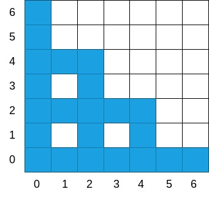

# Skočko

Učenik vaše škole je kreirao robota Skočka. Da bi ga testirao donijeo ga je na fudbalski teren vaše škole. U svrhe zadatka fudbalski terenćemo posmatrati kao beskonačno kvadratno polje. 

Skočko se na početku nalazi kod korner zastavice, na koordinati *(0, 0)*. On radi na sljedećem principu: postoje tačno `n` opruga pomoću kojih skače, svaka opruga ima snagu `L[i]`, koja mu omogućava da skoči `L[i]` metara nagore ili `L[i]` metara udesno. 

Dakle, uz pomoć opruge `i` koja ima snagu `L[i]`, sa pozicije (`x`, `y`) Skočko se može odbaciti na poziciju (`x + L[i]`, `y`) ili (`x`, `y + L[i]`). Poslije skoka, opruga se odbacuje i ne može biti ponovo iskorištena. Skočko može koristiti opruge u bilo kom redoslijedu. 

Pošto učenik još nije poradio na detaljima oko robota postoji vjerovatnoća da će Skočko ispuštati ulje tokom leta. Da ne bi morao sam da čisti igralište poslije testiranja učenik je odlučio da kupi podmetače i postavi ih na teren tako da prekriju sve tačke koju bi Skočko mogao preletjeti tokom testiranja. 

Sada učenika interesuje koliko tačno podmetača mora da kupi ako zna da svaki podmetač pokriva tačno jedan kvadratni metar terena. Vama se obratio za pomoć. 

## Ulaz
Prva linija ulaza sadrži cijeli broj `n` - koji pretstavlja broj federa koje Skočko ima na početku testiranja.

Druga linija sadrži `n` cijelih brojeva `L[i]` koji redom pretstavljaju snagu svakog federa.

### Ograničenja
```
1 <= n <= 100
L[i] >= 1
1 <= L[1] + L[2] + ... + L[n] <= 1 000 000
```

## Izlazni Podaci
Cijeli broj koji pretstavlja broj podmetača koje učenik mora ponijeti na testiranje.


## Primjeri
### Ulaz 1
```
2
4 2
```
### Izlaz 1
```
22
```
### Objašnjenje 1
Sve tačke igrališta koje se mogu uprljati tokom testiranja su obojene plavom na sljedećoj slici. Ukupno ih je 22.


