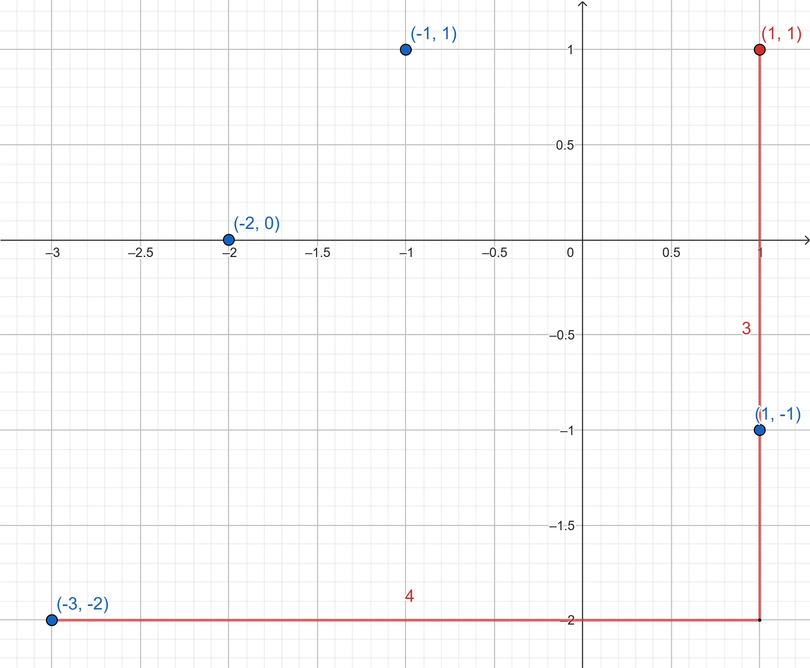
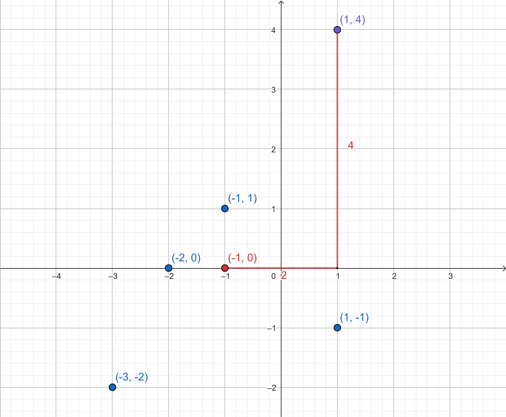

# Putovanje Profesora Alexa
Profesor Alex voli voditi svoje učenike na razne informatičke olimpijade. Kartu svijeta možemo predstaviti kao 2-dimenzionalnu ravan.

Na početko programa imamo `N` takmičenja gdje se `i`-to takmičenje nalazi na tački sa koordinatom `(Xi, Yi)`. Ali moguće je također u toku rada programa da saznate za novo takmičenje (opisano ispod).

U ovom zadatku imamo 2 vrste upita na ulazu:

1. Za datu koordinatu `(P, Q)` trebate ispisati udaljenost najdaljeg takmičenja **za koje znate u ovom trenutku** (uključujući one za koje saznate od upita 2. tipa) od date koordinate.

  - *Udaljenost između dvije koordinate `(x1, y1)` i `(x2, y2)` je `|x1 - x2| + |y1 - y2|` (tačnije, Manhattan udaljenost).*
  - *Za absolutnu vrijednost možete koristiti funkciju **abs(n)** iz biblioteke __math.h__*
  - *Samo inicijalna takmičenja i upiti tipa **2** koji su prethodili ovom upitu se računaju za ovaj upit.*

2. Saznajete da na koordinati `(P, Q)` postoji takmičenje.

## Ulaz
Na prvoj liniji unosa se nalazi broj inicijalnih takmičenja `N` i broj upita `Q`.

Na slijedećih `N` linija unosa nalazi se po dva broja.
Svaka linija sadrži brojeve `Xi, Yi`.

Slijedećih `Q` linija se sastoje od po tri broje.
Prvi broj je ili `1` ili `2`, označavajući tip upita i slijedeća dva broja označavaju koordinate zadatih tačaka `Pi` i `Qi`. 

### Ograničenja
```
1 <= N, Q <= 1 000 000
-100 000 000 <= Xi, Yi, Pi, Qi <= 100 000 000
```
- Podzadatak 1 (10 bodova): `2 <= N <= 1000` i `1 <= Q <= 1000`
- Podzadatak 2 (20 bodova): `Pi = Qi = 0` za sve upite tipa `1`
- Podzadatak 3 (70 bodova): Bez dodatnih ograničenja.

## Ispis
Za svaki upit tipa `1`, potrebno je ispisati jedan broj, udaljenost od najdaljeg takmičenja.

## Primjer
### Ulaz
```
4 3
-1 1
-2 0
-3 -2
1 -1
1 1 1
2 1 4
1 -1 0
```

### Izlaz
```
7
6
```

### Pojašnjenje primjera


Slika iznad prikazuje kartu svijeta nakon prvog upita, plave tačke označavaju aktivno takmičenje i crvena tačka je tačka navedena u prvom upitu. Vidimo da je udaljenost od najdalje tačke `3+4=7`.



Ovo je karta svijeta nakon 3. upita. Ljubičasta tačka je nova tačka.
